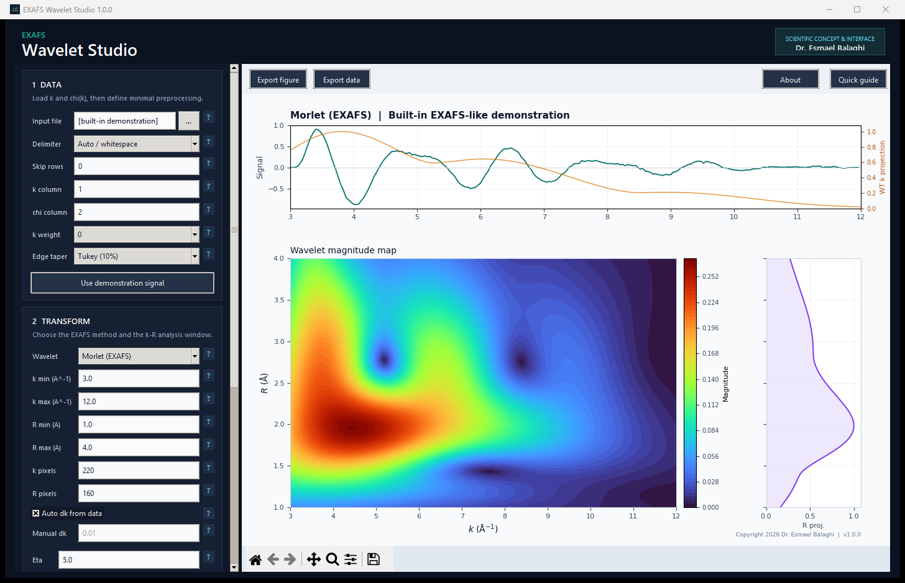

# EXAFS Wavelet Studio

A single-window desktop application for exploratory wavelet analysis of EXAFS
signals. It combines data import, beginner-friendly parameter help, Morlet and
Cauchy transforms, publication-quality plotting, and coefficient export.

[**Download the latest standalone Windows EXE**](https://github.com/sebalaghi/EXAFS-Wavelet-Studio/releases/latest/download/EXAFS_Wavelet_Studio.exe)



Scientific concept and interface: **Dr. Esmael Balaghi**  
Copyright 2026 Dr. Esmael Balaghi

## Fast start in PyCharm

1. Open this `EXAFS_Wavelet_Studio` folder as a PyCharm project.
2. Select Python 3.10 or newer as the project interpreter.
3. Open PyCharm's terminal and run:

   ```powershell
   python -m pip install -r requirements.txt
   ```

4. Run `xafs_wavelet_studio.py`.

The application opens with a built-in EXAFS-like teaching signal and calculates
an example Morlet map automatically. No data file is needed for the first run.
For the shortest hand-off instructions, give new users `START_HERE.txt`.

## Loading real data

The input must contain at least two numeric columns:

```text
# k (A^-1)     chi(k)
3.00           0.0182
3.05           0.0217
3.10           0.0241
```

Whitespace, tab, comma, and semicolon delimiters are supported. Lines beginning
with `#` are ignored. Column numbers in the interface start at 1.

If the selected signal column already contains `k^2 chi(k)` or another weighted
signal, leave **k weight** at 0. Otherwise choose the weighting exponent that
belongs to your analysis protocol.

## The important `dk` decision

`dk` is the numerical spacing used to integrate or resample along the measured
`k` axis. It is not a universal EXAFS constant.

- **Auto dk from data** is the recommended setting. For Morlet, the application
  uses the actual interval around every data point with trapezoidal integration,
  which also handles a mildly irregular grid. For Cauchy, the signal is resampled
  to the median interval because the FFT requires a uniform grid.
- **Manual dk** reproduces a fixed-step calculation. Its initial value is `0.01
  A^-1`, matching the legacy Python script. Use it only when you know the actual
  sampling step or intentionally need to reproduce an older result.

A wrong manual value rescales Morlet amplitudes. For Cauchy, it also changes the
resampling and internal R grid.

## Choosing the transform

### Morlet (EXAFS)

This is the method used by the original converter and follows Funke, Scheinost,
and Chukalina (2005). Start with `eta = 5` and `sigma = 1`.

- `eta` is the center angular frequency and participates in the k-R resolution
  trade-off. The paper discusses values around 4-15.
- `sigma` is the Gaussian-envelope width. Larger values favor R resolution;
  smaller values favor localization in k. The paper discusses approximately
  0.4-2.

The transform retains the zero-mean correction term from the published Morlet
formulation and the legacy code.

### Cauchy (EXAFS)

This method follows Munoz, Argoul, and Farges (2003) and the EXAFS implementation
in xraylarch. It requires a uniform k grid, so the application performs explicit
resampling and zero-pads the unmeasured region below the selected k minimum.

`FFT size = 2048` follows the xraylarch default. Increase it only when a denser
internal R grid is useful and additional computation time is acceptable.

## Reading the plot responsibly

- The top panel shows the processed signal and the normalized k projection of
  the wavelet magnitude.
- The main panel shows magnitude, power, real part, imaginary part, or phase.
- The right panel shows the normalized R projection of wavelet magnitude.
- Hover over the map for numerical k, R, and displayed intensity.

The R axis is an apparent, uncorrected EXAFS radial coordinate. It is not
automatically an exact bond distance because no scattering phase correction is
applied. Keep preprocessing, k weighting, ranges, transform parameters, and
normalization consistent when comparing samples.

## Export formats

- Figures: PNG, PDF, or SVG.
- Transform data: compressed NPZ, long-form TSV, or long-form CSV.

NPZ preserves the complex coefficient matrix and all arrays directly. Text
exports contain one row for each `(k, R)` pair and include magnitude, real,
imaginary, and phase values. The first line stores the full analysis settings as
JSON metadata.

## Build the Windows executable

Double-click `build_exe.bat`, or run it from a Windows terminal:

```powershell
.\build_exe.bat
```

The script creates an isolated `.venv-build` environment, installs the pinned
runtime and PyInstaller, runs the numerical self-test, and writes the standalone
application to:

```text
dist\EXAFS_Wavelet_Studio.exe
```

The one-file executable is necessarily much larger than the Python source
because it contains Python, NumPy, Matplotlib, Tcl/Tk, and their data files.

## Numerical check

Run the built-in smoke tests at any time:

```powershell
python xafs_wavelet_studio.py --self-test
```

The fuller unit suite is also included:

```powershell
python -m unittest discover -s tests -v
```

## Scientific references

1. H. Funke, A. C. Scheinost, and M. Chukalina, *Wavelet analysis of extended
   x-ray absorption fine structure data*, Physical Review B **71**, 094110
   (2005). DOI: 10.1103/PhysRevB.71.094110.
2. M. Munoz, P. Argoul, and F. Farges, *Continuous Cauchy wavelet transform
   analyses of EXAFS spectra: a qualitative approach*, American Mineralogist
   **88**, 694-700 (2003).
3. xraylarch, *XAFS: Wavelet Transforms for XAFS* and `cauchy_wavelet.py`.

See `THIRD_PARTY_NOTICES.txt` for the xraylarch MIT license notice.

## Scope

This application supports visualization, teaching, and exploratory analysis. It
does not replace documented data reduction, calibration, phase correction,
model fitting, uncertainty analysis, or expert scientific interpretation.
